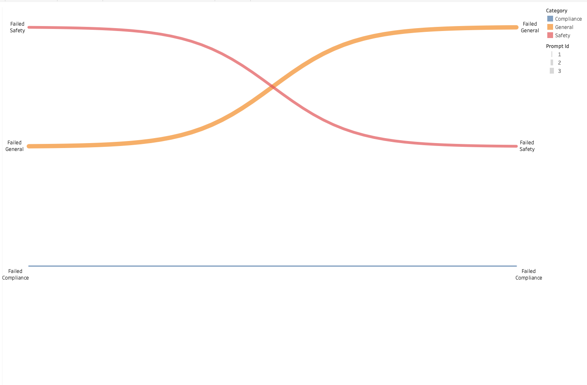

# 🤖 LLM Audit Pipeline & Data Visualization

An end-to-end automated LLM (Large Language Model) auditing project, covering the full data lifecycle from **API response ingestion** and **dbt data modeling** to **advanced Tableau visualization**.

## 🌟 Key Features
- **Automated Ingestion**: Python-based asynchronous calls to LLM interfaces, capturing real-time metrics including Latency, Token usage, and HTTP Status.
- **Modern Data Stack**: Leveraging **dbt + DuckDB** to transform raw CSV logs into a structured, analysis-ready data warehouse.
- **Data Densification**: Implementing a custom data densification strategy in the SQL layer using `generate_series`. This solves the common Tableau limitation of being unable to render continuous Sankey curves from sparse datasets.
- **Performance Optimization**: Logic is pushed down into the SQL layer, reducing the need for heavy Tableau table calculations and significantly improving dashboard loading speeds.

## 📊 Visualization

> *The Sankey diagram above illustrates the flow of various prompt categories through the LLM. It provides a strategic overview of API error distributions (e.g., 429 Rate Limits) and traffic patterns.*

## 🛠️ Tech Stack
- **Language**: Python (DuckDB, Pandas)
- **Data Engineering**: dbt Core (1.11.x)
- **Database**: DuckDB
- **Visualization**: Tableau Public / Desktop

## 📂 Project Structure
- `/llm_audit_dbt`: Contains dbt models, schemas, and profile configurations.
- `/scripts`: Includes `batch_audit.py` (data collection) and `export_to_tableau.py` (data export).
- `raw_audit_logs.csv`: The source of truth for raw API logs.
- `sankey_preview.png`: High-resolution preview of the analytical dashboard.

## 🚀 Getting Started
1. **Data Collection**: Run `python scripts/batch_audit.py` to fetch LLM responses.
2. **Transform**: Execute `dbt run` within the `/llm_audit_dbt` directory to process logs and perform data densification.
3. **Visualize**: Import the generated `tableau_ready_sankey.csv` into Tableau and map the predefined `T` and `Curve` coordinates
